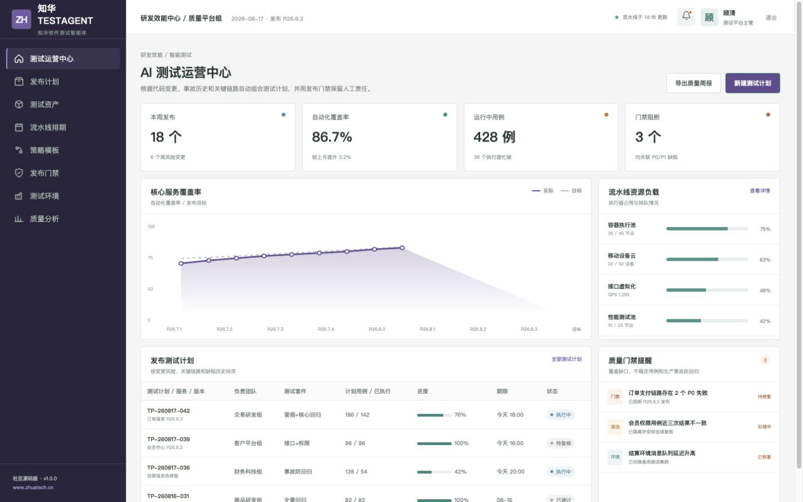
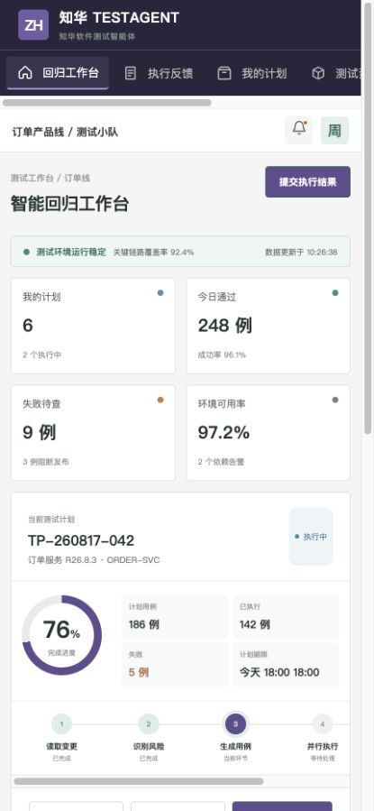

# 知华 TestAgent · AI 软件测试智能体

> 从一次代码变更开始，自动组合冒烟、关键链路、数据库迁移和事故防回归计划；发布裁决仍由团队负责。

[官网](https://www.zhuatech.cn/) · [架构](docs/architecture.md) · [接口](docs/api.md) · [部署](deploy/README.md) · [参与贡献](CONTRIBUTING.md)

版权所有 © 2026 **上海如静知华信息科技有限公司**。工程包名：`cn.zhuatech.testagent`。

## 一次发布在这里如何流转

```text
代码变更 → 风险识别 → 测试套件生成 → 并行执行 → 质量门禁 → 发布证据
```

`POST /api/ai/testing/design` 会依据变更风险、文件数量、关键流程、当前覆盖率、不稳定用例、数据库变更和线上事故生成优先级、用例数、目标覆盖率、测试套件及发布门禁。



管理端聚焦发布组合、覆盖率、执行器负载、P0/P1 阻断和人工审批。



工程师端用于执行回归、提交失败证据、查看环境状态和升级质量风险。

## 工程能力

| 领域 | 社区版能力 |
| --- | --- |
| 风险分析 | 变更风险、文件范围、关键流程、事故与数据库变更 |
| 测试设计 | 冒烟、接口契约、关键回归、迁移回滚和事故防回归 |
| 质量门禁 | P0/P1 阻断、覆盖率目标、不稳定用例隔离、人工例外审批 |
| 双端协作 | Vue 3 管理端 + 响应式 H5 测试工作台 |
| 工程基础 | Spring Boot、JWT、MySQL、Flyway、H2 测试、Docker Compose |

社区版采用可解释规则模拟 AI 规划，不连接外部模型，也不需要 API Key。

## 五分钟运行

```bash
cd frontend
npm install
npm run dev:demo
```

演示入口：管理端 `planner / Demo@2026`，测试端 `operator / Demo@2026`。演示服务、缺陷和发布版本全部为虚构数据。

## 许可与商业使用

本项目为社区源码项目，仅允许个人、非商业学习、研究与技术交流，**禁止商用**。企业内部生产使用、私有化部署、项目交付、SaaS、收费服务、品牌替换及二次销售，需取得上海如静知华信息科技有限公司书面授权，详情以 [LICENSE](LICENSE) 为准。

需要 AI 测试平台、研发效能体系、私有模型、软件实施或软件项目外包，可访问[知华科技官网](https://www.zhuatech.cn/)或扫码联系：

| 测试平台与技术咨询 | 商业授权与定制开发 |
| --- | --- |
|  |  |

SEO：AI 测试智能体、自动化测试平台、测试用例生成、回归测试、质量门禁、Java Vue 开源项目、知华科技。

<!-- Copyright 2026 上海如静知华信息科技有限公司 -->

## 企业级测试发布认证

新增 `POST /api/enterprise/testagent/test-release-certification`，覆盖需求追溯、关键路径、安全、性能、回归、环境、缺陷、证据和回滚，返回 `CERTIFY / CONDITIONAL / BLOCKED`。详见 [发布认证说明](docs/ENTERPRISE_RELEASE_CERTIFICATION.md)。
